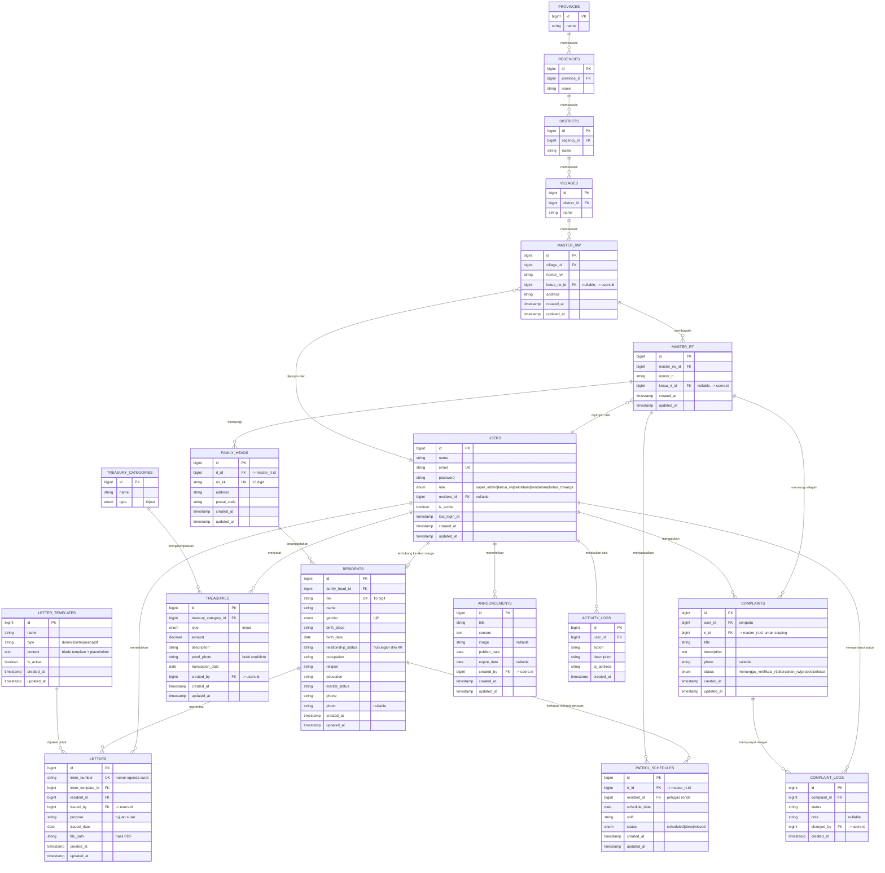

# Entity Relationship Diagram (ERD)
## Sistem Informasi Manajemen RW (SIM-RW)

Diagram ini menerjemahkan seluruh Functional Requirements pada [`prd.md`](./prd.md) (FR01–FR07) menjadi skema database. Nama tabel mengikuti konvensi Laravel (snake_case, plural) dan tabel inti (`master_rw`, `master_rt`, `residents`, `family_heads`, `letters`, `treasuries`, `complaints`) sesuai acuan di Bagian 11 PRD.

---

## Diagram

---

## Catatan Desain

1. **Wilayah administratif** (`provinces` → `regencies` → `districts` → `villages` → `master_rw` → `master_rt`) mengikuti hierarki Kemendagri agar kompatibel dengan struktur data Dukcapil di masa depan (lihat Bagian 2.2 PRD — integrasi Dukcapil V2).
2. **`users.role`** dibuat sebagai `enum` tunggal, bukan tabel `roles`/`permissions` terpisah, selaras dengan filosofi *Boring Stack* (Bagian 5 PRD) — cukup untuk RBAC sederhana via middleware (FR01.3).
3. **Isolasi data per RT** (Bagian 6.2 PRD): `family_heads.rt_id` dan `complaints.rt_id` menjadi kunci penerapan *Global Scope* Eloquent agar Ketua RT hanya melihat data wilayahnya.
4. **`users.resident_id`** bersifat nullable — dipakai saat akun Warga (Viewer) ingin ditautkan ke data kependudukan miliknya sendiri (untuk fitur cek tagihan/status pengaduan pribadi).
5. **`complaint_logs`** memisahkan riwayat status dari tabel `complaints` agar histori tracking (FR05.2) tetap utuh meski status terus berubah.
6. **`activity_logs`** mendukung kebutuhan Audit Trail (Bagian 6.3 PRD) — mencatat siapa, kapan, dan aksi apa.
7. Modul **Jadwal Ronda** (FR07, opsional V1) sudah dimasukkan sebagai `patrol_schedules` agar skema tidak perlu migrasi besar saat fitur ini diaktifkan.

## Cara Membaca Diagram

Notasi mengikuti standar Crow's Foot pada Mermaid:
- `||--o{` : satu ke banyak (one-to-many), sisi `o{` boleh kosong (opsional/nullable FK).
- `||--o|` : satu ke nol-atau-satu (one-to-zero-or-one).
- `}o--||` : banyak ke satu (many-to-one, dibaca dari sisi kiri).
